# 🎧 Audiotheca

**Music Metadata Catalog & Review System**

> A comprehensive music metadata platform where music editors and registered users collaboratively build and review a structured catalog of artists, works, and albums - **The IMDb for Music**.

[](https://github.com/Vukotije/audiotheca)
[](https://github.com/Vukotije/audiotheca)

---

## 📋 Table of Contents

- [About the Project](#-about-the-project)
- [UML Diagrams](#-uml-diagrams)
  - [Use Case Diagram](#use-case-diagram)
  - [Class Diagram](#class-diagram)
  - [Sequence Diagrams](#sequence-diagrams)
  - [Activity Diagrams](#activity-diagrams)
- [Tech Stack](#-tech-stack)
- [Project Structure](#-project-structure)
- [Installation & Setup](#-installation--setup)
- [Features](#-features)
- [Documentation](#-documentation)

---

## 🎯 About the Project

**Audiotheca** is a university project for the Software Specification and Modeling course, focusing on:

- **UML Modeling**: Comprehensive UML diagrams (Use Case, Class, Sequence, Activity)
- **Software Specification**: Detailed functional and non-functional requirements
- **Prototype Implementation**: Full-stack web application demonstrating core functionality

The platform aims to create a collaborative music database where:

- **Producers/Editors** can add and manage music metadata (artists, works, albums)
- **Registered Users** can write reviews, create playlists, and participate in polls
- **Administrators** manage user permissions and content moderation

---

## 📊 UML Diagrams

### Use Case Diagram

The use case diagram illustrates the main actors and their interactions with the system.

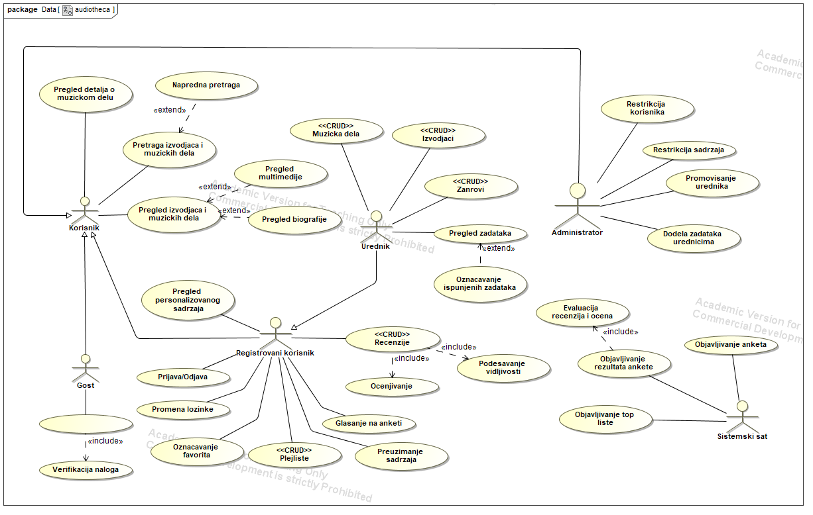

**Main Actors:**

- **Guest User**: Can browse content, search, and register
- **Registered User**: Can review content, create playlists, participate in polls
- **Producer/Editor**: Can manage music metadata (CRUD operations)
- **Administrator**: Can manage users, approve reviews, and moderate content

---

### Class Diagram

The class diagram shows the system's data model and relationships between entities.

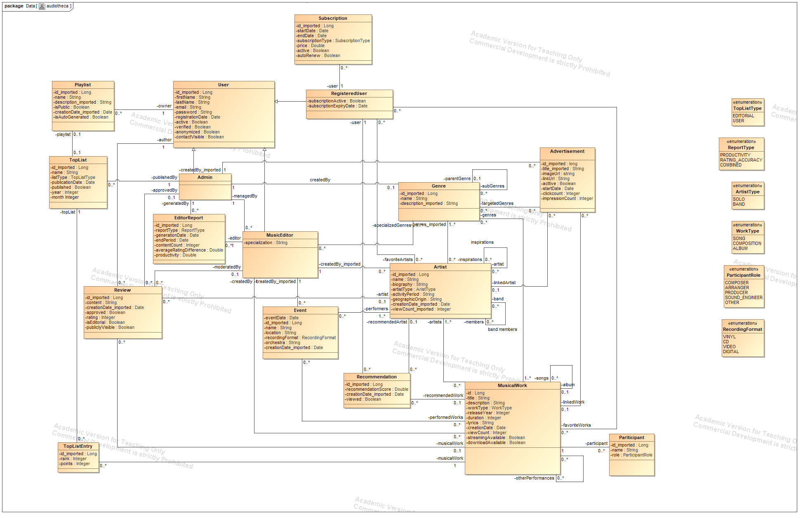

**Core Entities:**

- **User**: Base user entity with role-based permissions
- **Artist**: Music artist/performer information
- **Musical Work**: Songs, compositions, recordings
- **Genre**: Music genre classification
- **Review**: User-generated reviews and ratings
- **Playlist**: User-created music collections

---

### Sequence Diagrams

Sequence diagrams demonstrate the flow of operations for key use cases.

#### User Registration

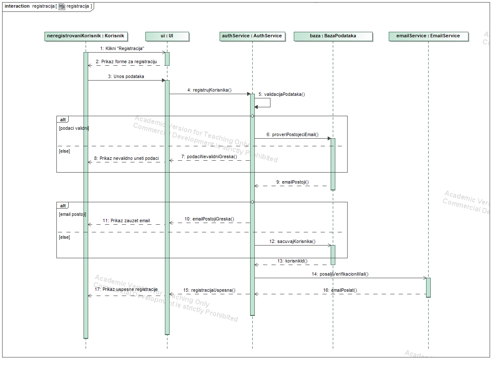

#### Password Recovery

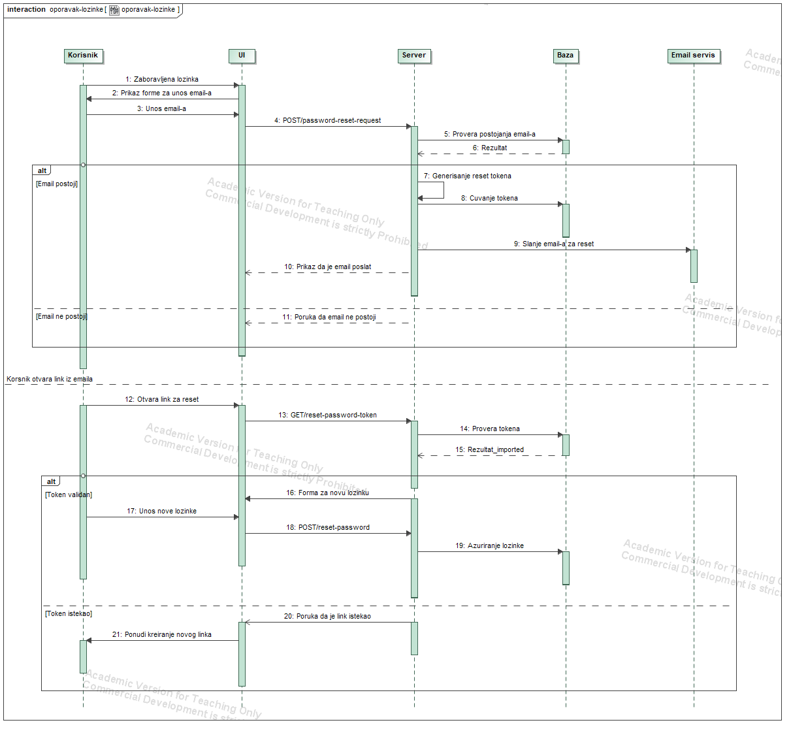

#### Creating a Playlist

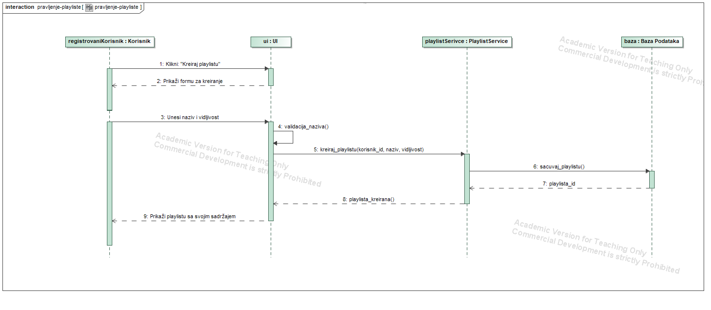

#### Recommendations System

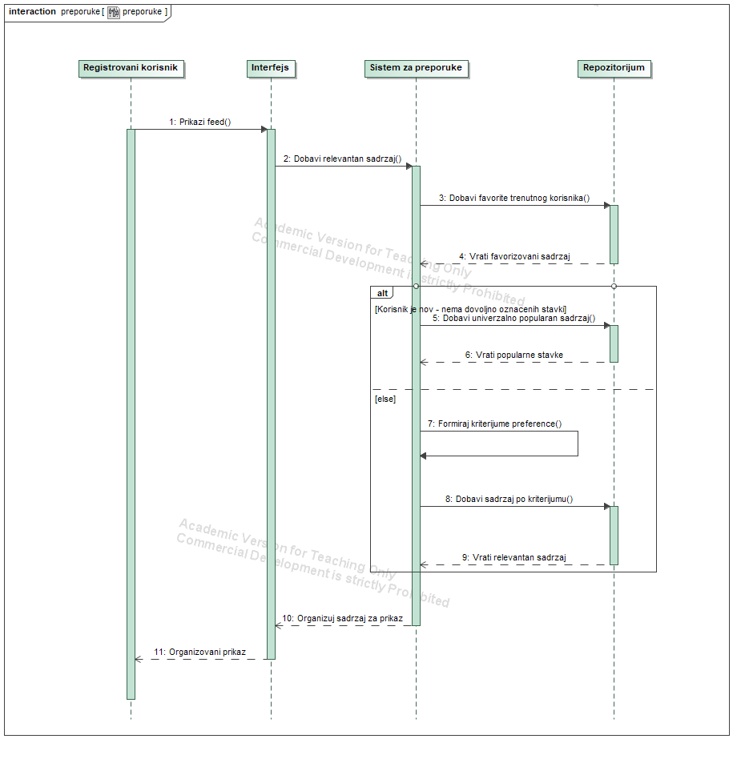

#### Poll System

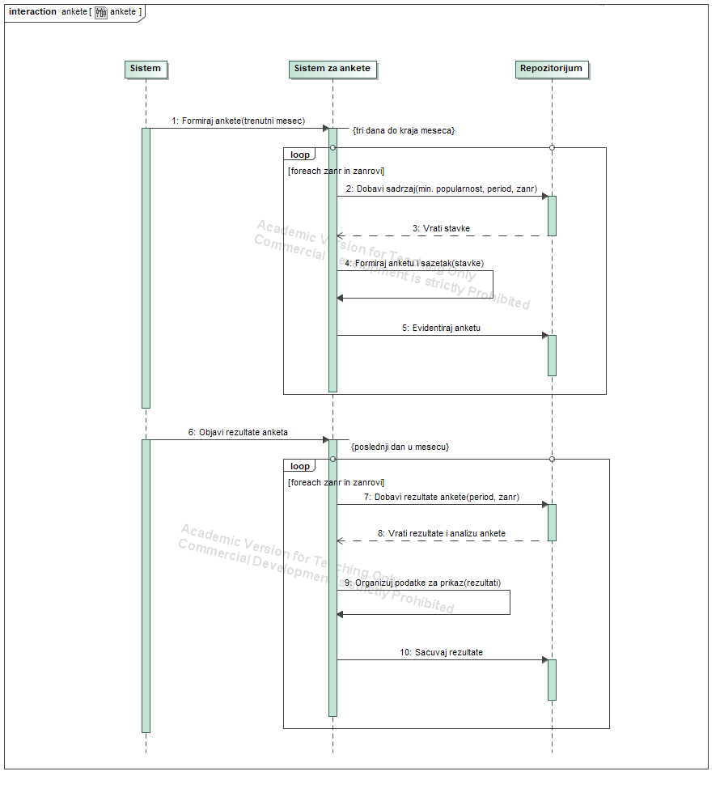

---

### Activity Diagrams

Activity diagrams illustrate the workflow for various user actions.

#### User Login

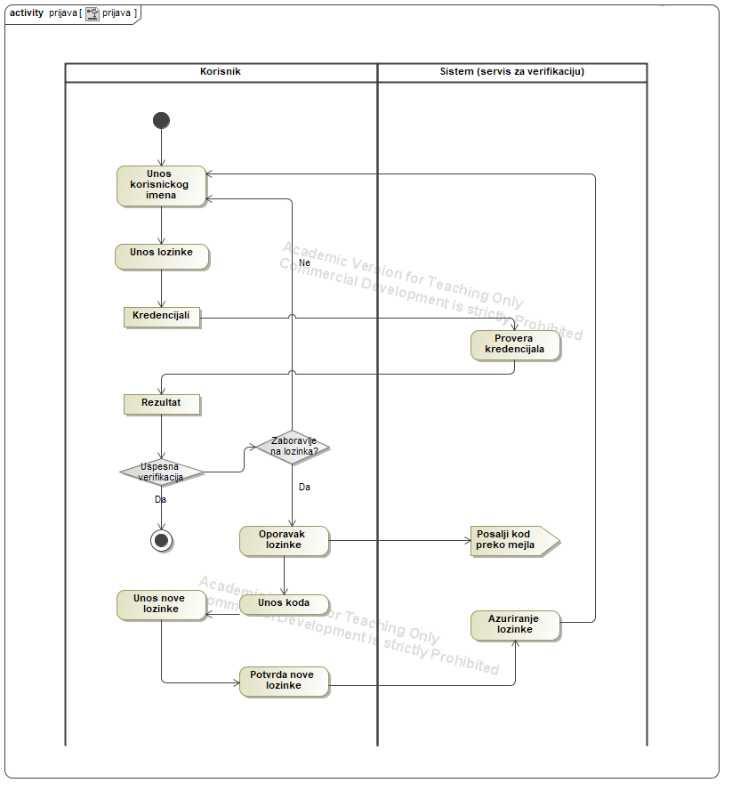

#### Admin Blocks User

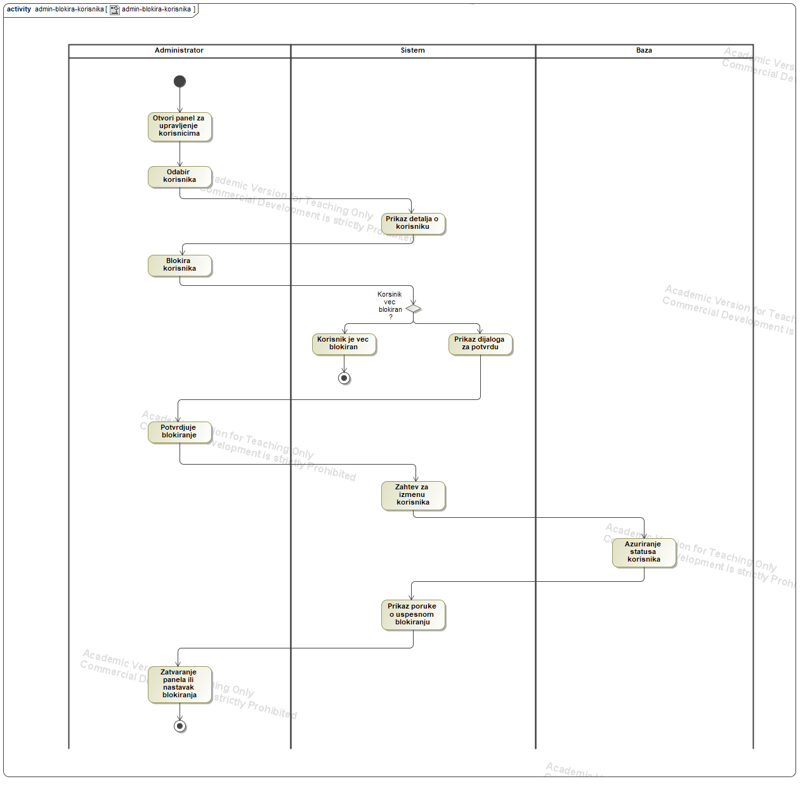

#### User Review Submission

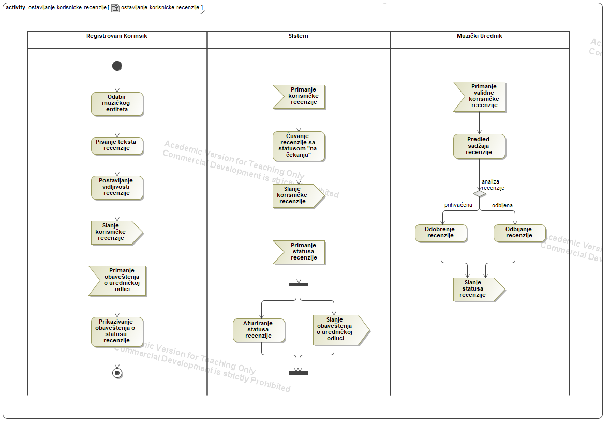

#### Creating and Publishing Top Lists

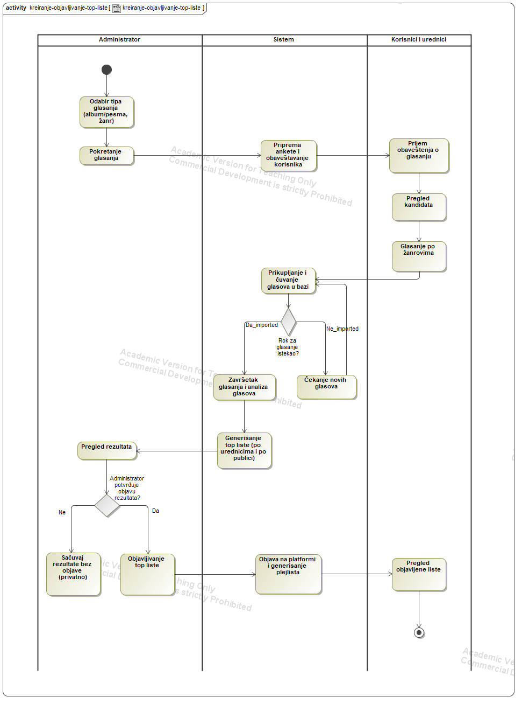

#### Task Management

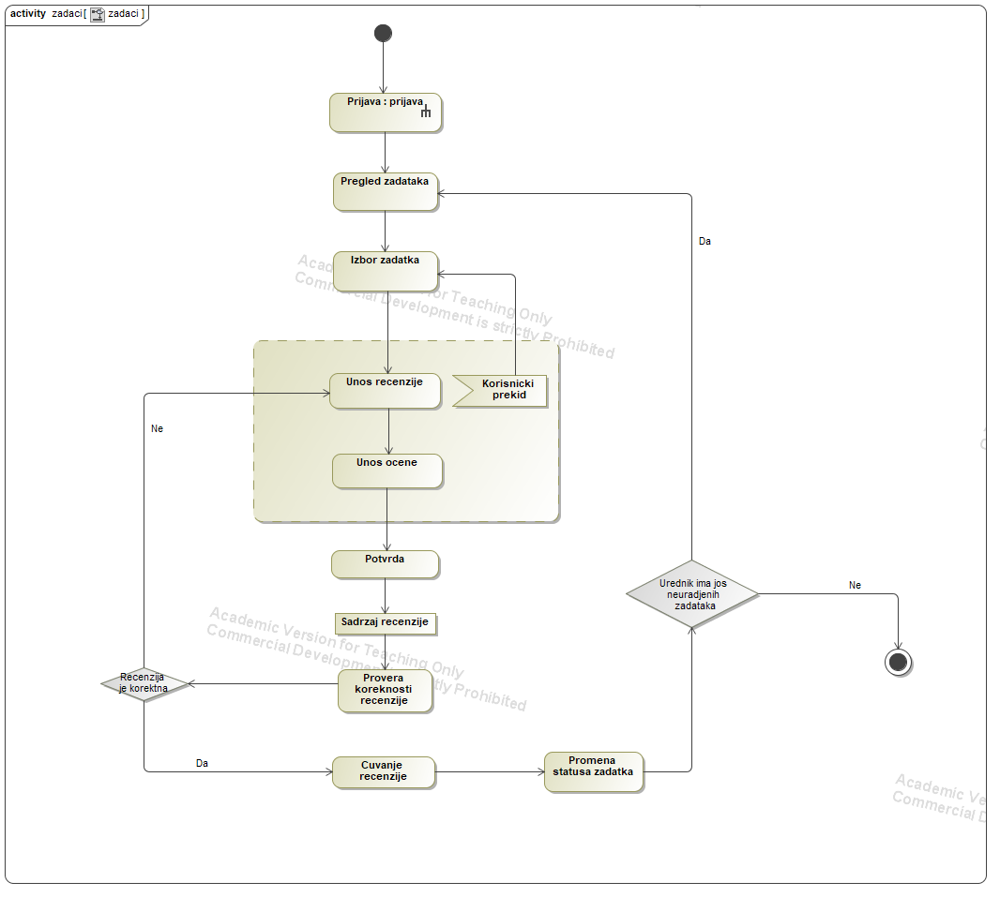

---

## 🛠 Tech Stack

### Backend

- **Framework**: Flask 3.0.0
- **Database**: PostgreSQL with SQLAlchemy 3.1.1
- **Authentication**: JWT (Flask-JWT-Extended 4.6.0)
- **API**: RESTful API with CORS support
- **Validation**: Marshmallow 3.20.1

### Frontend

- **Framework**: React 18.3.1 with TypeScript 5.6.3
- **Build Tool**: Vite 5.4.10
- **Routing**: React Router DOM 6.26.2
- **State Management**: Zustand 4.5.4
- **Styling**: Tailwind CSS 3.4.18
- **HTTP Client**: Axios 1.7.7

### Development Tools

- **API Testing**: Postman / Thunder Client
- **UML Modeling**: MagicDraw (diagrams.mdzip)
- **Version Control**: Git & GitHub

---

## 📁 Project Structure

```
audiotheca/
├── 📄 README.md
├── 📁 assets/
│   └── diagrams/              # Exported UML diagrams (PNG)
│       ├── activity/          # Activity diagrams
│       ├── class/             # Class diagram
│       ├── sequence/          # Sequence diagrams
│       └── use-case/          # Use case diagram
├── 📁 docs/
│   ├── diagrams/
│   │   └── diagrams.mdzip     # MagicDraw UML project file
│   └── spec/
│       └── Specifikacija.docx # Full project specification
├── 📁 prototype/
│   ├── 📁 back-end/           # Flask REST API
│   │   ├── env.example        # Environment variables template
│   │   ├── requirements.txt   # Python dependencies
│   │   └── src/
│   │       ├── app.py         # Flask application factory
│   │       ├── config.py      # Configuration settings
│   │       ├── models.py      # SQLAlchemy models
│   │       ├── run.py         # Application entry point
│   │       ├── repositories/  # Data access layer
│   │       │   ├── artist_repository.py
│   │       │   ├── genre_repository.py
│   │       │   ├── musical_work_repository.py
│   │       │   ├── review_repository.py
│   │       │   └── user_repository.py
│   │       └── routes/        # API endpoints
│   │           ├── admin.py
│   │           ├── auth.py
│   │           ├── producer.py
│   │           ├── search.py
│   │           └── user.py
│   └── 📁 front-end/          # React + TypeScript SPA
│       ├── package.json
│       ├── vite.config.ts
│       ├── tailwind.config.ts
│       └── src/
│           ├── App.tsx        # Main application component
│           ├── main.tsx       # Application entry point
│           ├── types.ts       # TypeScript type definitions
│           ├── api/
│           │   └── client.ts  # API client configuration
│           ├── components/    # Reusable components
│           │   ├── Layout.tsx
│           │   ├── ProtectedRoute.tsx
│           │   ├── RoleGuard.tsx
│           │   ├── SearchBar.tsx
│           │   └── ui/
│           ├── pages/         # Page components
│           │   ├── admin/     # Admin dashboard
│           │   ├── artists/   # Artist pages
│           │   ├── auth/      # Login/Register
│           │   ├── genres/    # Genre management
│           │   ├── profile/   # User profile
│           │   ├── reviews/   # Review management
│           │   ├── search/    # Search functionality
│           │   └── works/     # Musical works CRUD
│           └── store/
│               └── auth.ts    # Authentication state
```

---

## 🚀 Installation & Setup

### Prerequisites

- **Python 3.10+**
- **Node.js 18+** and npm
- **PostgreSQL 14+**

### Backend Setup

1. **Navigate to backend directory:**

   ```bash
   cd prototype/back-end
   ```

2. **Create virtual environment:**

   ```bash
   python -m venv venv
   venv\Scripts\activate  # Windows
   ```

3. **Install dependencies:**

   ```bash
   pip install -r requirements.txt
   ```

4. **Configure environment variables:**

   ```bash
   cp env.example .env
   # Edit .env with your database credentials
   ```

5. **Run the application:**
   ```bash
   python src/run.py
   ```

The API will be available at `http://localhost:5000`

### Frontend Setup

1. **Navigate to frontend directory:**

   ```bash
   cd prototype/front-end
   ```

2. **Install dependencies:**

   ```bash
   npm install
   ```

3. **Start development server:**
   ```bash
   npm run dev
   ```

The application will be available at `http://localhost:5173`

---

## ✨ Features

### For All Users

- 🔍 **Advanced Search**: Search for artists, works, albums by multiple criteria
- 📊 **Browse Catalog**: Explore comprehensive music metadata
- 📖 **Read Reviews**: View user and critic reviews

### For Registered Users

- ✍️ **Write Reviews**: Submit reviews and ratings for musical works
- 📝 **Create Playlists**: Organize favorite tracks into custom playlists
- 🗳️ **Participate in Polls**: Vote in community polls
- 💡 **Personalized Recommendations**: Get music suggestions based on preferences

### For Producers/Editors

- ➕ **Add Content**: Create new artists, works, and albums
- ✏️ **Edit Metadata**: Update and maintain music information
- 🏷️ **Manage Genres**: Organize music by genre classifications
- 📋 **Review Management**: Approve or reject user-submitted content

### For Administrators

- 👥 **User Management**: Manage user accounts and permissions
- 🛡️ **Content Moderation**: Review and moderate user-generated content
- 📊 **System Analytics**: View platform statistics and usage
- 🚫 **Block Users**: Suspend accounts violating terms of service

---

## 📖 Documentation

### Specification Document

The complete project specification (functional requirements, non-functional requirements, use cases) is available in:

```
docs/spec/Specifikacija.docx
```

### UML Diagrams Source

The original UML diagrams created in MagicDraw can be found in:

```
docs/diagrams/diagrams.mdzip
```

### API Documentation

The backend API follows RESTful conventions. Main endpoints include:

- **Authentication**: `/api/auth/login`, `/api/auth/register`
- **Users**: `/api/users/*`
- **Artists**: `/api/artists/*`
- **Musical Works**: `/api/works/*`
- **Genres**: `/api/genres/*`
- **Reviews**: `/api/reviews/*`
- **Search**: `/api/search/*`

---

## 👥 User Roles

| Role                | Permissions                                           |
| ------------------- | ----------------------------------------------------- |
| **Guest**           | Browse, Search, View public content                   |
| **Registered User** | Guest + Reviews, Playlists, Polls, Recommendations    |
| **Producer/Editor** | User + Create/Edit Artists, Works, Albums, Genres     |
| **Administrator**   | All permissions + User management, Content moderation |

---

## 🎓 Academic Context

**Course**: Software Specification and Modeling  
**Institution**: Faculty of Sciences, University of Novi Sad  
**Academic Year**: 2024/2025  
**Focus Areas**:

- UML Modeling (Use Case, Class, Sequence, Activity Diagrams)
- Requirements Engineering and Software Specification
- Software Architecture and Design Patterns
- Prototype Development

---

## 📝 Project Status

🟡 **Prototype Phase**

Current implementation includes:

- ✅ Core data models (User, Artist, Work, Genre, Review)
- ✅ Authentication system (JWT-based)
- ✅ Role-based access control
- ✅ RESTful API endpoints
- ✅ React frontend with routing
- ✅ Basic CRUD operations
- 🚧 Advanced features (recommendations, polls) - In Progress
